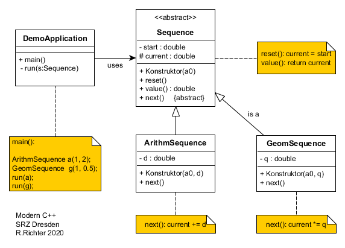

# Inheritance

* abstraction of interface
* common implementation

## Base class and derived classes

* base class (super class, parent class): common interface (and maybe some implementation)
* derived class (sub class, child class): what is different to other classes

```cpp
class Base 
{
    // common interface (+data)
};

class Derived : public Base 
{
    // additional / changed methods (+data)
};
```

Liskov substitution principle (LSP, Barbara Liskov 1994): A subtype object can be used like a base type object without changing the desirable properties of a program.

Derived and base class objects have an „is a“ relationship: a `GeometricSequence` is a `Sequence`.

```cpp
int main()
{
    auto a = ArithmeticSequence{1,2};
    auto g = GeometricSequence{1,2};
     run(a);   
    run(g);
}
```

using common interface = calling common methods of base class `Sequence`:

```cpp
auto run(Sequence& s)
{
    for (auto i = 0; i < 10; ++i)
    {
        std::cout << s.value() << ' ';
        s.next();
    }
    std::cout << '\n';
}
```

Q: 

* Why a parameter reference is required, why not value parameter? Think of derived class with additional data.
* Which methods / data should go into base class `Sequence`?
* In which methods / data differ derived classes `ArithmeticSequence` and `GeometricSequence` from each other / from base class?
* Draw class diagrams and mark class relationships.
* How to get initializing parameters from derived constructors to base constructors? 



## Derived class

Constructors of derived classes delegate initial values to base class constructor:

```cpp
class ArithmeticSequence : public Sequence
{
public:
    ArithmeticSequence(Number start, Number step) 
    : Sequence{start}
    , step_{step} 
    {
    }    
    void next() override { current_ += step_; }
private:
    Number step_;
};
```

Q:    

* Why is inheritance marked `public Sequence`? What is private / protected inheritance?
* What does `private` mean in C++? Do derived class method have access to private members of base class?
* What does (optional) keyword `override` mean?

## Back to base 

declares common member (methods and data)

```cpp
class Sequence
{
public:
    Sequence(Number start) 
    : current_{start} 
    {
    }
    
    auto value() const { return current_; }
    // ... next()
protected:
    Number current_;
};
```

Allow `protected` access for derived classes to data members.

## Virtual and abstract methods, virtual destructor

Q: How to declare / implement `next()` in class `Sequence`?

```cpp
    void next() {}
```

leads to error in derived classes: cannot override `next()`, has to be a *virtual method*:

````cpp
    virtual void next() {}
````

Does implementing `Sequence::next()` have any sense? Should we have instances of base class? If not, mark it as *abstract method*:

```cpp
    virtual void next() = 0;
```

A class with not overridden abstract methods is called *abstract class*. You can`t instantiate objects of an abstract class.

Beware! Important rule:  To prevent resource leaks, whenever you declare a base class with virtual methods, also define a virtual destructor:

```cpp
    virtual ~Sequence() = default;
```

We will understand that, when we know about runtime polymorphism. (Also, there may be some exceptions...)

## Runtime polymorphism and late binding

How to translate to German?

> This is a virtual disaster.

Virtual means the special way in which an object of a special type behaves (reacts to a message): An arithmetic sequence has to add, a geometric sequence has to multiply to reach to the next value.

Since subtype object can be used instead of base type objects (Liskov substitution principle), a reference (or pointer) can refer to a derived object (*runtime polymorphism*). Which *virtual* `next()` method is to be called depends on the subtype of the object. It can`t be determined during compile time (*early binding*). It is postponed until the latest possible moment at runtime: at the function call there has to be an object, that has some (sub)type (*late binding*).

## Pointers to polymorphic objects

 ```cpp
std::shared_ptr<Sequence> ptr = nullptr;

if (1 == some_user_input())
    ptr = std::make_shared<ArithmeticSequence>(1,2);
else
    ptr = std::make_shared<GeometricSequence>(1,2);
if (ptr)
    run(*ptr);
 ```

Q: Which destructor has to be called?

A: The correct (virtual) one! 

TODO: polymorphic containers: `std::vector<std::shared_ptr<Base>>`

## Exercise

Implement a hierarchy of classes 
for a matchmaking agency 
([text in German](../examples/heiraten/heiraten.pdf))
generating [this output](../examples/heiraten/output.txt).
Base class 
[interface](../examples/heiraten/src/single.h)
and
[implementation](../examples/heiraten/src/single.h) 
are given. 


